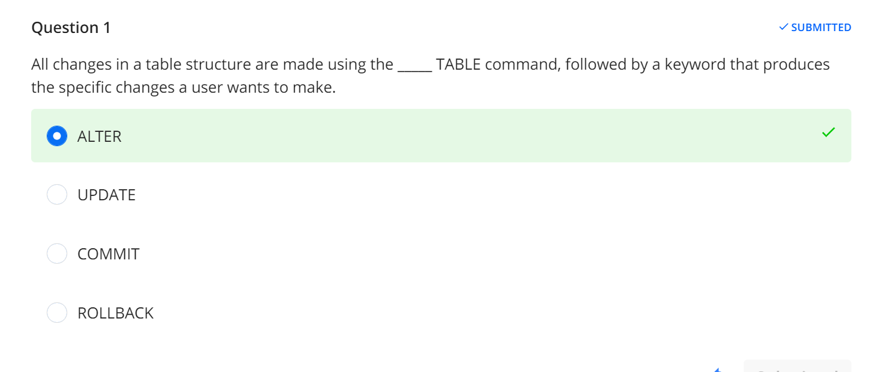
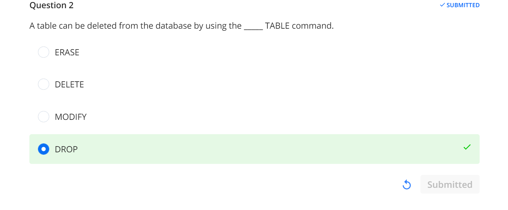
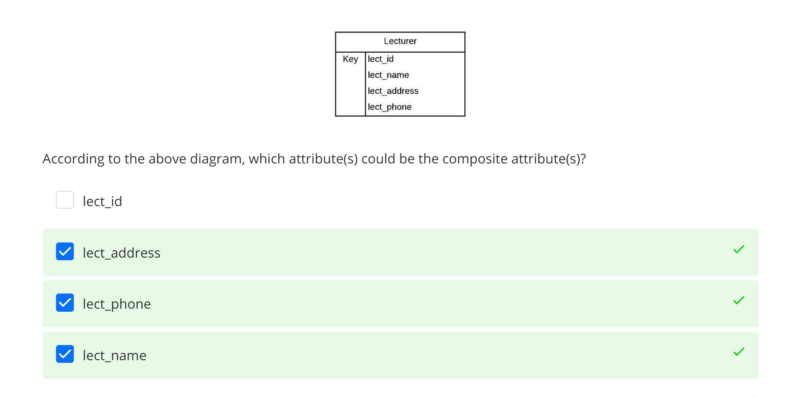
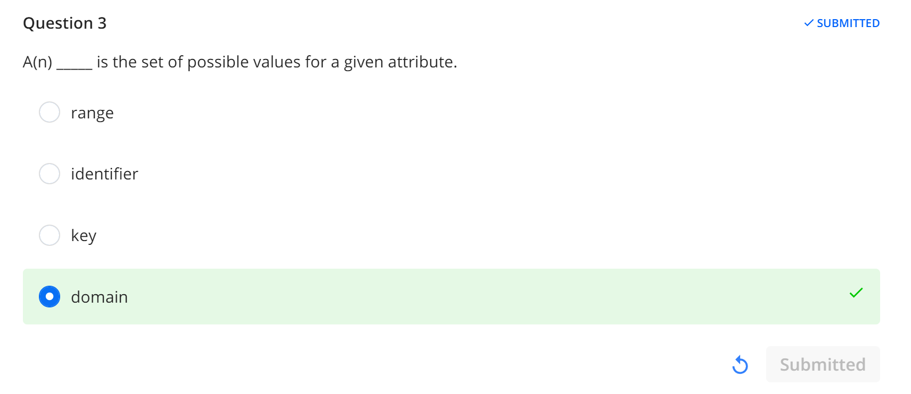
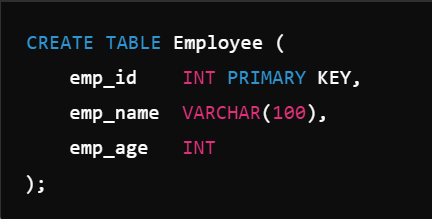

# Command

## ALTER

## UPDATE

# Attribute

## simple attribute

cannot be subdivided

## composite attribute

canbe subdivided to yield additional atttributes

## single-valued attribute

## multi-valued attribute

# Keys
## Primary Key
## Foreign Key
## candidate Key
## attribute key

# entity

## Strong entity

got existence-independence(can exist independently)

can exists apart from all of its related entities

has a primary key that uniquely identifies each of its instances.
must have a primary key

example:

## Weak entity
A weak entity cannot be uniquely identified by its own attributes alone. Instead, it depends on a strong entity, and its existence is dependent on that strong entity.