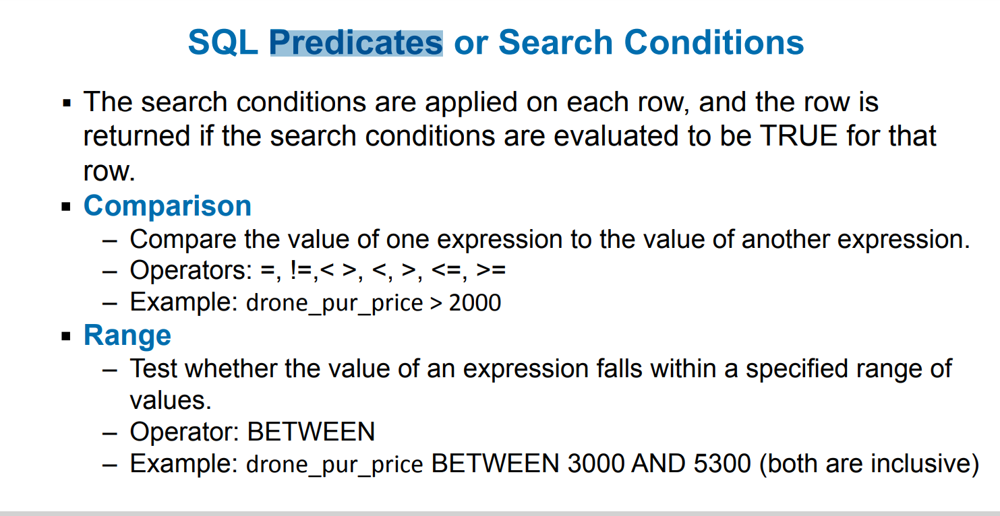

# Weak vs Strong Entity

## Strong entity

-- entity is something like a branch, class
-has a key which may be deined without reference to other entities.

- for example employee entity
  -----strong entity do not need other things to proof its identity

## Weak enity

- has a key which requires the existence of one or more other entities
- for example family entity - need to include the key of employee to create a suitable key for  family
  ---weak entity does not got unique key

## Database designer often determines whether an entity can be described as weak based on business rules

- customer pays monthly acount
  -- key: cust_no, date_paid,or
  -- invented Key: payment_no(surrogate - not at conceptual level)

# Identifying vs Non-identitying relationship

## iedntifying

-- identifier of A is part of identifier of B
--shown with solid line

## non- identitying

-- identifier of A is not part of idntifier of B

# types of attributes

▪ Simple
– Cannot be subdivided
– Age, sex, marital status
vs
▪ Composite
– Can be subdivided into
additional attributes
– Address into street, city, zip
▪ Single-valued
– Can have only a single value
– Person has one social security
number
vs
▪ Multi-valued
– Can have many values
– Person may have several college
degrees

# Types of Attributes continue

▪ Derived
– Can be derived (calculated ) from
other attributes
– Age can be derived from date of
birth (why would we not store age in
a database?)
– total value of an order can be
calculated from items in the order
– Difficult to judge - store or calculate,
during design ALWAYS include all
attributes required by the client

# Associative or composite entity

usually need bridging entity

# Foreign Key

- role of foreign key is to connect

the line means maximum and minimum
relationship must have description

## Relation Properties contidion

- Tuple values are atomic---cannot be divided
  ---- employee(eid, ename,departno, dependants)
  -----not allowed: dependants(dep_name, dep_age) multivalued
  --- hence no multivalued(repeating) attributes allowed, called the first normal form rule

# question:

### candidate key

unique, in order to identify, minimum unit of super key

### super key

as long as super include a candidate key, it becomes super key

### primary key

can be only one

### alternate key

on candidate key is chosen to be the primary key of a relation. Remaining conadidate keys are termed alternate keys.

# Null

# Writing Relations

-relations may be represented using the following notation

# Business rules

- runners may form a team, the runner who registers the team is recorded as the team leader.
- identify the FK(s):
  TEAM(team_id, team_name, team_leader)
  RUNNER(runner_id, runner_name, team_id)
  A. team_leader in Team
  B. runner_id in RUNNER
  D. Team_id in RUNNER

# Relational DMLs

▪ Relational Calculus
▪ Relational Algebra
the way to manipulate data
▪ Transform Oriented Languages (e.g. SQL)
▪ Graphical Languages
▪ Exhibit the “closure” property - queries on relations produce
relations

# SQL vs Relational ALgebra in the Database

select project_manager
FROM prdetail
WHERE project_code = '25-5A

## natural join

# tuple

# Domain

list of possible values

# primary key

cust_id, order_id
( combination of order_id & order_time could also be primary key)

# foreign key

foreign key exist in not only one entity, (use for identification)

project (𝝿),

 select (𝛔),

 join (⨝)

# keys determines each other

if both keys are candidate keys, they can determine each other:
e.g. TFN determins id, id determins TFN

## Partial dependency

see the graph provided above,

## UNF to 1NF ( NF means normal Form)

# partial dependency

**a situation in which a non-key attribute of a table depends on only a part of the primary key**

key depend on only part of the primary key

to remove partial dependency, we need to create a new entity

# Transitive dependency

non-key depending on non-key

# optimum setup

# normalization

when you jump From UNF to 1NF you need to remove RG, and insert Primary key

to jump from 1NF to 2NF you nned to remove PD

From 2NF to 3NF , remove Trasnsition dependency

# Repetition

# question

1. a 1NF info:   Primary key could be:
   Doctor id, appointment Date
   patient id, appointment date
   surgery room.no , appointment date

**When working with a potentially composite attribute, you must consider how it is depicted on the form/report** . If the attribute is depicted as non-decomposed, then you should treat it as a simple attribute for the purposes of normalisation.  *However* , this decision must be informed by any further information that you have about the scenario you are modelling.

# when you design something you need to base on the customer need

# Surrogate keys

# Backbone Networks

## Metropolitan Area Networks (MAN)

## Wide Area Networks (WAN) &

# VPN

totally 2 IP address,sender&receiver
ip address is part of the VPN server
ip address used to form a package
encryped, and a new ip address will be formed

# SQL statements

data definition language(DDL)
--creating database structure,, create TABLE, ALTER TABLE, DROP TABLE

data manipulation language(DML)
--adding and manipulating database contents(rows)
• INSERT, UPDATE, DELETE

DAta control language(DCL)

- set permissions on objects
- GRANT, REVOKE

# NUMBER(6,2)

range 1000.00( range 9999, precision 0.01)

# DATE/TIME(4)

# CHAR(4)

is a string(fixed, unchangeable)

# Text: CHAR(size), VARCHAR2(size)

- CHAR(10)---'apple'='apple     '# automatically filled up spaces
- VARCHAR2(10)---'apple'-->'apple     '

# Numbers : NUMBER(precision, scale)

-weight NUMBER(7) or NUMBER(7,0) --> weight =7777777

- Weight NUMBER(9,2) --> weight=7777777.77
- Weight NUMBER(8,1) --> weight = 7777777.7

# Date/Time: DATE, [TIMESTAMP]

- DATE can store a date and time(time to sec), stored as Julian date
- TIMESTAMP can store a date and atime(up to fractions of a second)
- TIMESTAMP WITH TIME ZONE

## if you didn't named a constrain , the system will named it for you

# restrictions

- RESTRICT
  unable to delete PK if there're corresponding tuple
- CASCADE
  a deletion of a tuple in the table referred by the FK will result in the
  deletion of the corresponding tuple in the table containging the FK
- NULLIFY
  a deletion of a tuple in the table reffered by the FK will result in the update of the corresponding tuples in the table containing the FK to NULL
- SET NULL
  set a field into NULL

# Manipulate constrains

# Logical model

logical model shouldn't contain data types--for example(NUMERIC(3,2))

if we need to add something not in the Table, we need to use ALTER

when you type(NOT NULL), it means it is mandatory

each attribute should have a meaning comment

# ALTER

create table and Alter all keys together

format:

ALTER TABLE `<table name>`

Add constraint `<constraint name>`

---Primary key ()
-----------------

---

---

---

ALTER TABLE customer ADD CONSTRAINT customer_pk PRIMARY KEY ( cus_code );

ALTER TABLE customer
    ADD CONSTRAINT customer_agent_fk FOREIGN KEY ( agent_code )
        REFERENCES agent ( agent_code )
            ON DELETE SET NULL;

# Constraint

check

# bridge entity

# surrogate entity

# Table

every table has a primary key

# Bridge

if relationship is many to many, need a bridge

