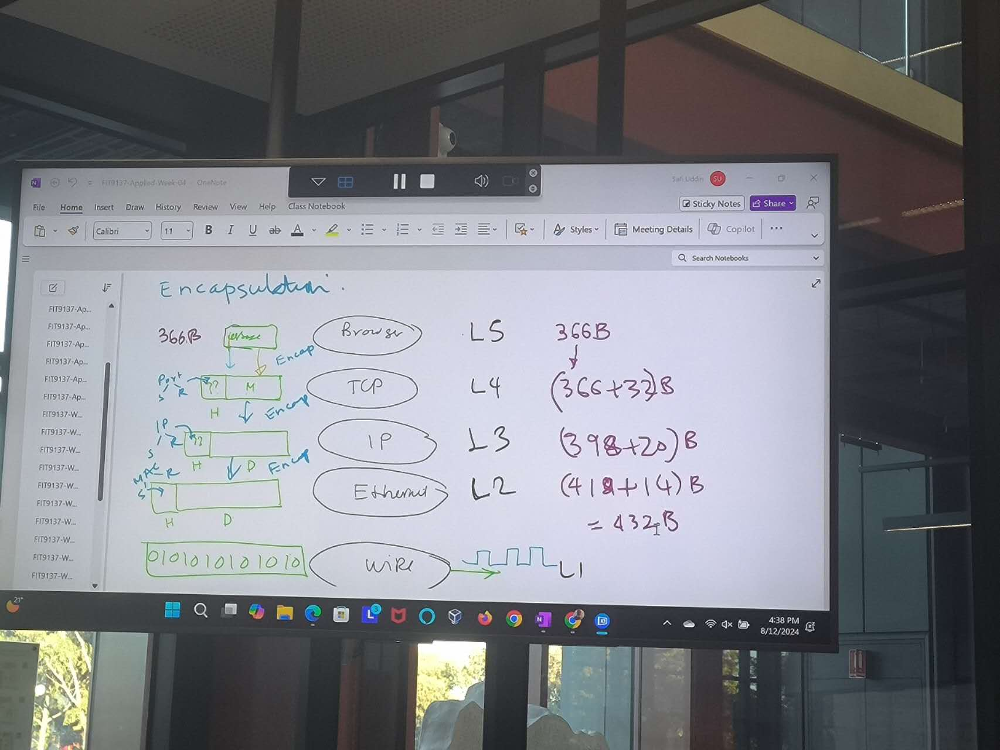
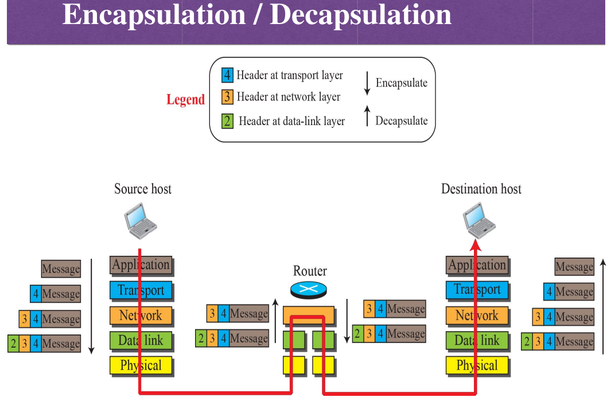
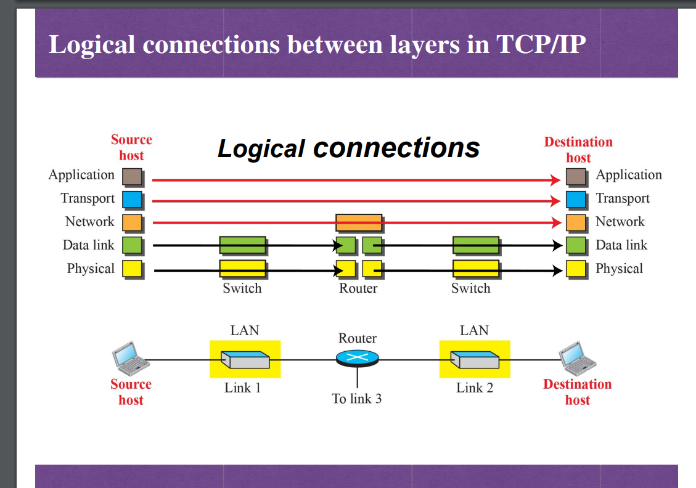
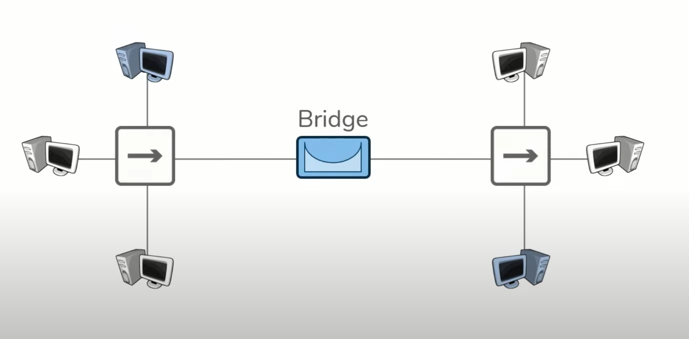
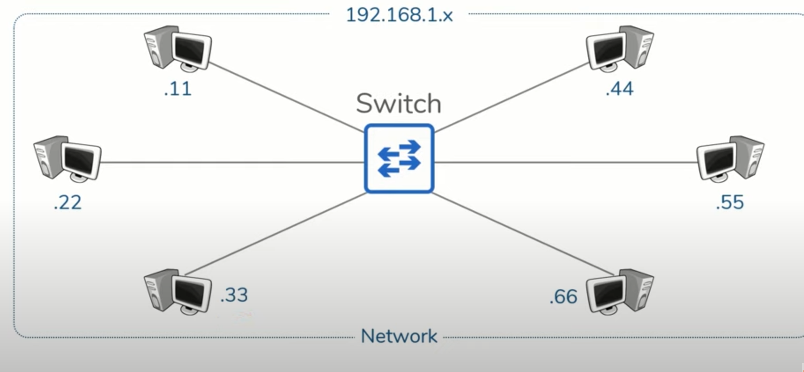
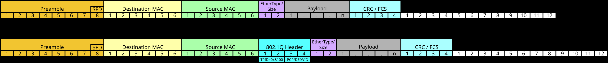
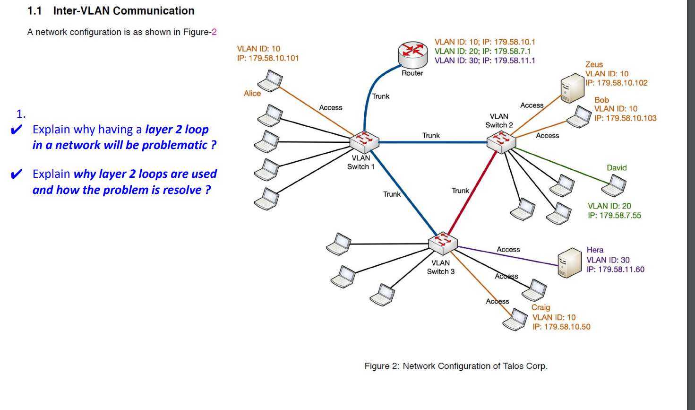
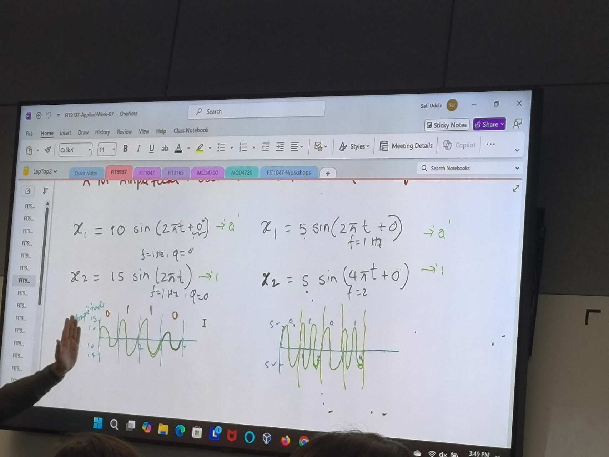
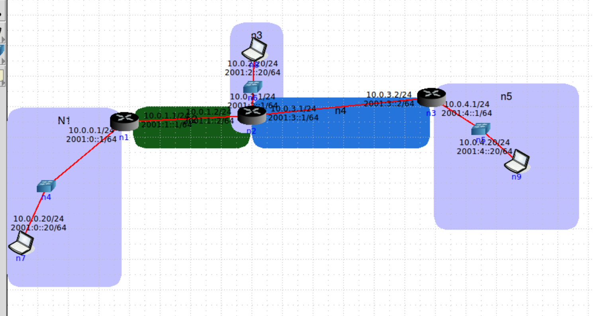
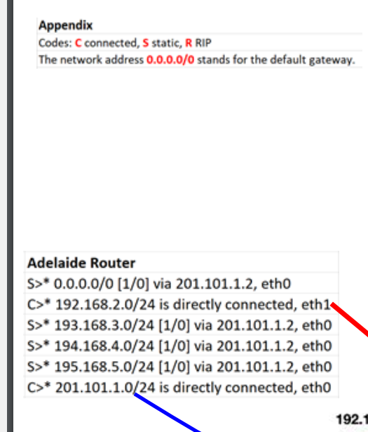

# OS

- File mangement
- memory management

### process management

when something is in the memonry ( for example look at your task manager , those which occupate your cpu)

- what is a process? it is a programm in management

## Cpu

memory in Cpu is called " register"

- context

## FIFO- fast in and fast out

- who came first who execute first

## LRU - least recently used

- only need to check the input, dontchare about what's already there

## non-pre-emptive scheduling algorithms:

- e.g.First-in first-out, Shortest job first, Priority
  scheduling

### Round-robin scheduling

## Deadlock

- when two processors want to use a shared resources
  ------check

## Hard link

it still workd even the file does not exist

## soft link

shortcut

# command

## touch

create a file-- touch aaa.txt

## pico

edit a file -- pico touch aaa.txt
after finisthed editing, press ctrl+x , and press Enter to quit

## search

ls -l *.txt
search for files ended with .txt

## softlink

ln -s original.txt original_softlink.txt

# i

ls -i *.txt
ls -il *.txt

# encapsulation

# decapsulation

# multiplexing

# Demultiplexing

# logical connecton

# physical connection

# MAC address(48 bit)

Hex: 10:FA:5F:F0:01

# IP address

- 139.108.111.95

## IP address V4( IPV4)

32 bit

# Port ID-(16 bit)

- on layer4

# URL

- URL belongs to server, and is only for the server
  e.g. my.monash.edu

# data passing process

# multiplexiv

# demultiplexiv

# Message Encapsulation (all layers)

## Application

Protocol Data: message
address: Names
 ---HTTP www.youtube.com

## Transport

Protocol Data: Segment/User datagram
address: port numbers
---TCP

## Network

Protocol Data: Packet
packet names: datagram
address:
--IP

## Data Link

Protocol Data: Frame
--Eternet

## Physical

Protocol Data: Bit
-- Encoded binary bits ....01010..

# encap/decap process

to both sender and receiver

# Multiplexing and De-mltiplexing

to both sender and receiver

# commands

## www.xxx.com

- https, application layer

## nslookup www.monash.edu

- it returns:
  Name: www.google.com
  Address: 172.217.167.68

## ifconfig -a

shows all hardware-address , networkaddress.etc
( in modern computer ther's no collisions)

## ping www.monash.edu

--ping -i 0.3 -w 1

## traceroute www.onlyfans.com

----traceroute -l ---resolve-hostnames

## unzip xxxx.zip

### Total FRAME size :

eternet header+ ip header+ TCP header+ Http header

# Repeaters

repeaters regenerate signals
which allows communications across greater distance

# Hube

-are simply multi-port repeaters

- facilitates scaling communication between additional hosts
- everyone receives everyone else's data

# Bridge

sit between hub-connected hosts
bridges only have two ports
Bridges learn which hosts are on each side

# Switches

-combination between hubes and bridges

- multiple ports
- learn which hosts are on each port
  

# Network

grouping of hosts which require similar connectivity

# Shared vs Switched Ethernet

shared usually cause collision
switch made point to point connection, no collesion

# CSMA/CD

# CSMA/CA

CA means collison avoidness
、

# Switch vsRouter

 forwarding table uses the MAC address, routing table use the IP address
 forwaring have only one destination per port
 routing table only one one
 routing tables connect different subnets
 [forwarding does not changes while  routing tables  changes when the network changes]???
 routing tables and forwarding are all set up automatic

# VLAN identifier

12 byte

# Inter Vlan communication

Spanning tree protocol (STP) (IEEE 802.1D) is  **predominantly used to prevent layer 2 loops and broadcast storms and is also used for network redundancy** .

A switch floods a frame if it has an unknown unicast, multicast, or broadcast address in the destination address field.

# Week 7

FM encoded message

# Week9

Layer5

Web brow

ser----web server       (both using http)

## Layer4:

TCP ---TCP

3 way handshake:    tcp- syn----ack-syn-----ack -> link created

Time graph showing how it works

Client---------Server

# Week 9 

N2 doesnt know n3,n4,n5 so you need to give command to N2 that ip route add <n3,n4,n5> via 192.168.1.2

exercise: ping all router

.0.0.0.0 means default 

s means static route

c means cable  in the graph there 're 2 cables
