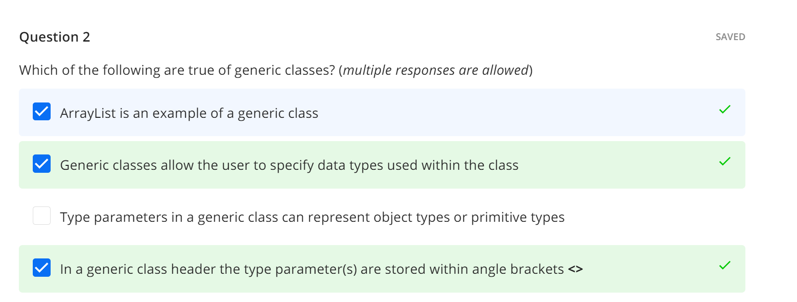
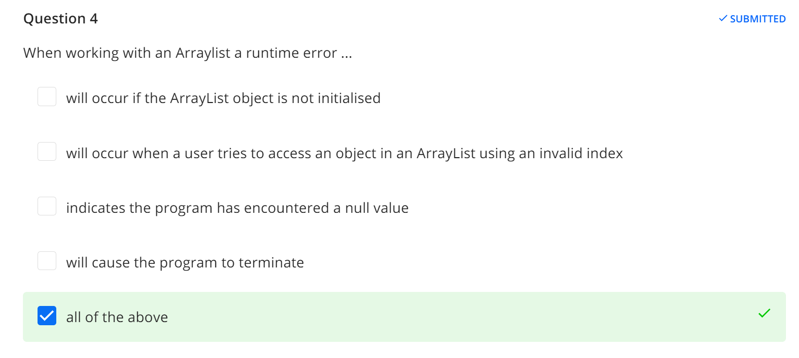

Class:
{
    fields: to store value
    constructor: initialize(the object)
    method: implement the behaviour of object

}

# Method:

access modifier
return datatype

## Local variable

## precedence

# Questions

## 1. What is the correct way to declare and initialize an integer variable in Java?

 int number = 10;
 int Number = &#39;10&#39;;
 Int number = 10;
 number = int 10;
2. Which of the following statements about the String data type in Java is true?
 String is a primitive type and uses single quotes for its values.
 String is a special class that can be used without creating an object and uses
double quotes for its values.
 String is a primitive type and uses double quotes for its values.
 String is an object type that cannot be used without creating an object.
3. What is the purpose of the assignment operator (=) in Java?
 To declare a variable.
 To assign a value to a variable.
 To compare two variables.
 To create a new class.
4. Which of the following is a correct way to declare a char variable in Java?
 char letter = &quot;A&quot;;
 char letter = A;
 char letter = &#39;A&#39;;
 char letter = &#39;10&#39;;
5. Which of the following is NOT a primitive data type in Java?
 int
 double
 boolean
 String

# iteration

the main purpose of iteration is to allow a computing system to perform tasks repeatedly until a certain condition is met.

# Initialisation of a counter or flag

We can have a counter that keeps track of the number of times the loop runs. Alternatively, if we do not have a fixed number of iterations in mind, we can initialise a boolean flag and the loop will keep running until the flag's value is changed—for example, from true to false. When executing a loop, the instruction to initialise the counter or flag is only executed once.

# Boolean condition

A boolean condition is used to decide when to stop repeating the loop and exit to the next instruction following the loop construct. We can specify compound conditions where the loop iterates until all the conditions are met. The boolean condition is evaluated with each iteration of the loop and the loop executed repeatedly until the condition has been met.

# for loop

# while loop

# do-while

Similar to the while loop, the do-while loop does the initialisation once outside the loop body. The body of the loop is then executed. At the bottom of the loop the increment/decrement/reset is performed. Then the boolean condition is tested and if it evaluates to true, the loop is executed again.  This is repeated until the boolean condition evaluates to false.

The main difference between the while and do-while loops is that the do-while loop runs at least one time whereas the while loop may not execute even once.

# Nesting loops

Loops can be nested within each other in a similar way to selection statements.  Here is an example.  Try to work out what the code will do before you run the program.

# Exiting Loops

The break statement is used to terminate the loop immediately and the continue statement is used to skip the current iteration of the loop.

## collections

Java addresses the need for data structures through the use of collections. Collections allow the programmer to store data in an organised way within the program.
Most of the collections in Java are found in the java.util.Collection framework of classes in the Java library.  The Collection framework supports three main type of collections - Lists, Queues, and Sets.
  Another type of collection in Java, which is not part of the Collection framework, is an array.

## The main difference is that arrays need to be assigned a certain capacity when instantiated;

   the other collections can grow and shrink in size automatically when objects are added or removed.

# data structure-- Array

  The first type of data structure we will discuss is a fixed-size collection, also known as an array.
  --supported in almost every programming language.
  --Arrays are collections whose size is defined by the programmer when the array is initialised, and this size cannot be changed over the lifetime of the variable
  --Since arrays have a fixed size, the computing system allocates the memory for the entire array of elements sequentially. This means that accessing items within the array is quicker and more efficient than variable size data structures.

## size of array wont changed

# nextline()

  advances this scanner past the current line and returns the input that was skipped.

# string.charA

# string.length

# .nextInt

# Substring of a string

A substring of a string may be obtained using the substring() method in the String class.  The substring() method returns the substring as specified by index values passed to this method. There are two variants of the method, one where the start index is specified and the other where you can specify both start and end indexes.

aString.substring(startIndex) // returns the substring from the specified index
aString.substring(startIndex, endIndex) // returns the substring from the specified
    // start index until (but not including)the
                                           // character at the end index
substring(0,3)

## equals

if ( a equals b)--------if (a==b)

# xxx.length()

# xxx.substring(start index, end index)

returns a substring
114514.substring(0,3) ----114

# xxx.charAt(index)

return the location at a specified location

# xxx.trim()

returns a copy  with leading and trailing whitespaces omitted.
String a = " asf "
a.trim() ---"asf"

# xxx.toUpperCase()

turn to uppercase

# +

+ equals to join
  can be used on calculation
  can be used on string

# xxx.nextline()

e.g. Scanner console =  new Scanner(System.in);
xxx = console.nextline()

# for loop

for(i=0; i<1;i++)
  new[i] = arr[i]

# concat()

if (str1.compareTo(str2) < 0)
            System.out.println(str1.concat(str2));
        else
            System.out.println(str2.concat(str1));

combine both string together

# charAt(int index)

return the char value at the specific index

# javadoc -d ./ ***.java

# javadoc -d ./docs ***.java

# javac -d .docs classOne.java

# StringBuffer

StringBuffer xx = new StringBuffer();

string created by stringbuffer can be changed

xxx.apend("awefwef")

xxx.insert(6, "there");

# Math.random()

this creates a random number [0,1)

int r = (int)(Math.rancom()*10 +1);

# GenericClass

## this allow programmer to delay defining the data type to be used  until the object of type of class is instantiated

public class GenericClass `<Type>`
{
    private Type attributeOne;

    public Type getAttributeOne()
    {
        return attributeOne;
    }

    public String display()
    {
        return "" + attributeOne;
    }

    public void setAttributeOne(Type attributeOne)
    {
        this.attributeOne = attributeOne;
    }

    public static void main(String[] args)
    {
        GenericClass`<Integer>` objOne = new GenericClass `<Integer>`();
        objOne.setAttributeOne(10);
        System.out.println("First generic value = " + objOne.display());
        GenericClass `<String>` objTwo = new GenericClass `<String>`();
        objTwo.setAttributeOne("Hello");
        System.out.println("Second generic value = " + objTwo.display());
    }

}

# ArrayList

import java.util.ArrayList

it is not a fixed list like Array

# Set & add (method)

## First need to import java.util.Arraylist

xxx.set(1,2) ----= replace(1,2)

xxx.add(1,awef) = append(1,awef)

# get(method)

used for accessing an element in a list

xx. get(index -1)

### need to mention that need to (index-1)because the first char of it is index 0

# remove(method)

delete the object completely from the collection ( not replace with null)

after removed, the index of the remaining objects will be decremented by 1

xx.remove(index)

# hashmap

import java.util.HashMap

### equals to dict in python but in the form of (a,b)

all keys are unique

xx = new HashMap<>()

xx.put(id, desc)

if you want to search for an item:  xxx.get(id)

you can also use xxx.size()

if want to make validation , use :   if (products.containsKey(id)){}

# HashSet

import java.util.HashSet

xxx = new HashSet<>()

hashset uses key to access elements

if we want to add something:  xxx.add(values[0])

xxx.remove()

validation:

if (words.contains(value))

xxx.size()

## question 1: whats the difference between HashMap and HashSet?

# question 2:

# Null-pointer expection

## Null pointer exception

## Question 4 : runtime error

# For each Loop

this doesn't need to know the exact number of item in the collection, it automatically exit when the end of the colleciton is reached

### when we use For Each Loop , java handles the indexing of the elements and the iteration for us

java does not allow deletion of elements duinght the iteration of For-each_loop

# replace

# how to answer test question

1.display the smallest number among a,b,c

# mid-semester test(on paper)

error type, loop, logic, coding standard, array

e.g the difference between the pre-text loop and posttest loop

The `while` and `for` statements are pretest loops; that is, they test the condition first and at the beginning of each pass through the loop.

Java also provides a posttest loop: the `do`-`while` statement. This type of loop is useful when you need to run the body of the loop at least once.

For example, in Section [5.7](https://books.trinket.io/thinkjava/chapter5.html#validate) we used the `return` statement to avoid reading invalid input from the user. We can use a `do`-`while` loop to keep reading input until it’s valid:

## https://books.trinket.io/thinkjava/chapter7.html

---
