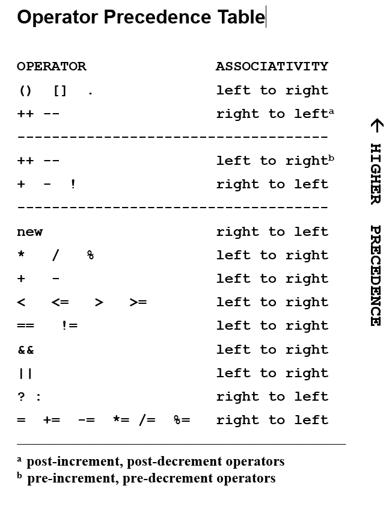
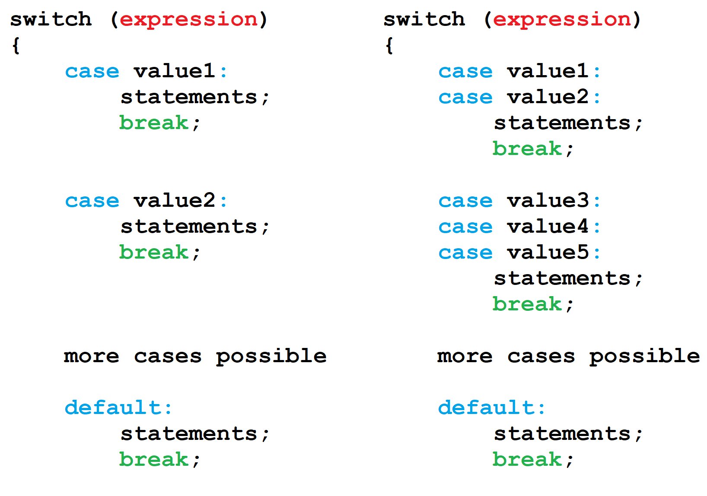
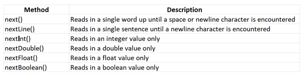

+ Addiition
- substraction4
* mutiplication
/ division= will always return a float
% Modulo=return the remainder of a division
// Integer Division= will always return an integer
** Exponentiation = x^y

xxx.count() = return how many times it ooccurs
xxx.isnumeric() = returns True if all characters in the string is numeric
xxx.find(xxx) = find the first occurance of the specific value in the string and returns an index

math.gcd(1,10) = find the biggest common divisor of the two
math.sqrt(144) = find the square root
math.sin(pi)= returns the sine of different numbers

float and integer:
print(3 ** (4 % 3 + 1) + 15 // (3.2 + 3.8) )------------it yield with float because there are float inside ,it turns all things into integer

question: we know that int(114.514)=114
how to turn it into 115?
answer: int(114.514 + 0.5)

# JAVA
int - an integer number 
double - a floating point number
char - a single character $%^&
boolean - a boolean value ( True/ False)

### Fields:
  are used to store the values of the attributes for an object. Fields define the state of the object.
    Fields are declared at the class level. Essentially, this means that they are declared within the class body and not inside any specific method. As such, these variables are accessible to every method within that class.  As a principle we try to keep the number of fields to a minimum. We will explain this more when we cover scope later in this module.

### Constructors
 are used to assign initial values to the attributes of a newly created object. A constructor ensures that the object is in a valid state.

### Methods
 implement the behaviour of an object.

### System (class)

### public 
-  classes, methods or constructors declared public can be accessed from any other class. However, if the public class we are trying to access is in a different package (group of classes), then the public class will need to be imported into the program.

### private
 - methods, variables, and constructors that are declared private can only be accessed within the declared class itself. The private access modifier is the most restrictive access level. Using the private modifier is the main way that an object encapsulates itself and hides data from the outside world.

### protected 
- this is a more advanced concept in programming. This access modifier fits between the public and private access modifiers. This modifier allows for sections of the code to be accessible to other classes that use inheritance (a concept we will cover later in this unit).

### int total;
 // declaration of variable "total" of the type unit
total = 10; // definition of variable total

### declaration
if we want to create something, first need to declare it in a field;
e.g. private String awefawef;S
incorrect declaration: private string awefaw = "awef";

### Java is a stronly typed programming language. This means that any variables must be declared using a data type.
#### String is a special class:  ex: String value = "Something";

float: need to add F at the end like: 4.454F
long : longer integer: 423266353L
double: 
byte:
short:
int: 
char：    
boolean：

instructions:
not - returns the logical opposite of its operand 

&&   and - the result is true only if both operands are true

||     or - the result is false only if both operands are false

relational operators: <,<=>>,!=

boolean expressions: return a true or false value
mark >= 70 && mark < 80
logical operators: &&, ||,
Compound assignment operators(e.g., +=)
Increment/decrement operators(++,--)
Evaluation of expessions: precedence and associativity
Implicit type conversion :
if-else statements: 
if (xxxx && dxx)
  dddd = ssss;
else
  dddd = ddv; 

# precedence

### switch statement:
A switch statement can have many number of case labels.
The break instructions after every case is needed to prevent execution 'fall through' into  the next label's statement.
The default is optional. If no  default is given, it may happen that no case is executed.
### switch can only handle 3 data types: int char boolean

consequent : xxx.out.println..... 

### print and println
println() will print it in a new line
print() will print on the same line

### printf (formatting)
Value using println: 10.34556767
Value using printf: 10.35
printf = printf("%.2f%n", val)

### next

a cascaded if-else -
a nested if-else: guess < hiddenNum

### parse
Each datatype's class has a method which begins with the word parse, which can be used to convert a String value into the value corresponding to the required primitive datatype.

### selection
selection: a control structure
if...else
switch
conditional operator: ?:
e.g.: mark > 0 ? "valid":"not valid"

int enrolment = 100;
enrolment + 100 //this expression will gets 200

int numberone = 100
numberone =99//turns it into 99

### difference between state and attribute
no difference 
for example numberone = "1" then the state is 1

### local variables
Local variables are declared in sections of Java code such as a block, a loop statement, or a function body. They are created and initialized when the code section execution starts and disappear when it finishes. The declaration consists of the variable type, name, and optional initialization. The declaration is a statement, so it should end with a semicolon. 

# for loop
for (int i = 0; i < numbers.length - 1; i++)
1. initialization 
int i =  0  is initializing the loop control, start with i and i =0
2. condition i< numbers.length -1 >
loop will continue as long as i is less than numbers.length -1
3. update
after each iteration of the loop, i = i+1