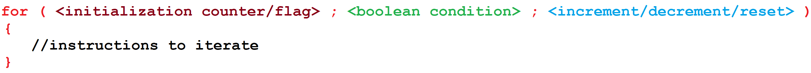
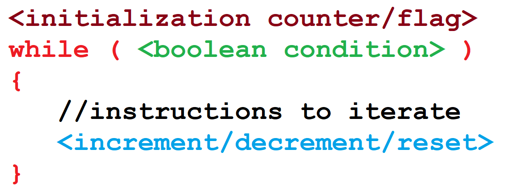

Class:
{
    fields: to store value
    constructor: initialize(the object)
    method: implement the behaviour of object

}
# Method:
access modifier 
return datatype
## Local variable
## precedence
# Questions
## 1. What is the correct way to declare and initialize an integer variable in Java?
 int number = 10;
 int Number = &#39;10&#39;;
 Int number = 10;
 number = int 10;
2. Which of the following statements about the String data type in Java is true?
 String is a primitive type and uses single quotes for its values.
 String is a special class that can be used without creating an object and uses
double quotes for its values.
 String is a primitive type and uses double quotes for its values.
 String is an object type that cannot be used without creating an object.
3. What is the purpose of the assignment operator (=) in Java?
 To declare a variable.
 To assign a value to a variable.
 To compare two variables.
 To create a new class.
4. Which of the following is a correct way to declare a char variable in Java?
 char letter = &quot;A&quot;;
 char letter = A;
 char letter = &#39;A&#39;;
 char letter = &#39;10&#39;;
5. Which of the following is NOT a primitive data type in Java?
 int
 double
 boolean
 String

# iteration 
the main purpose of iteration is to allow a computing system to perform tasks repeatedly until a certain condition is met.

# Initialisation of a counter or flag
We can have a counter that keeps track of the number of times the loop runs. Alternatively, if we do not have a fixed number of iterations in mind, we can initialise a boolean flag and the loop will keep running until the flag's value is changed—for example, from true to false. When executing a loop, the instruction to initialise the counter or flag is only executed once.

# Boolean condition
A boolean condition is used to decide when to stop repeating the loop and exit to the next instruction following the loop construct. We can specify compound conditions where the loop iterates until all the conditions are met. The boolean condition is evaluated with each iteration of the loop and the loop executed repeatedly until the condition has been met.

# for loop

# while loop
