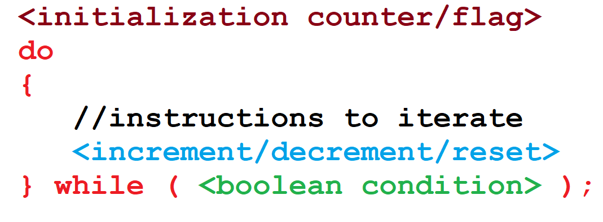
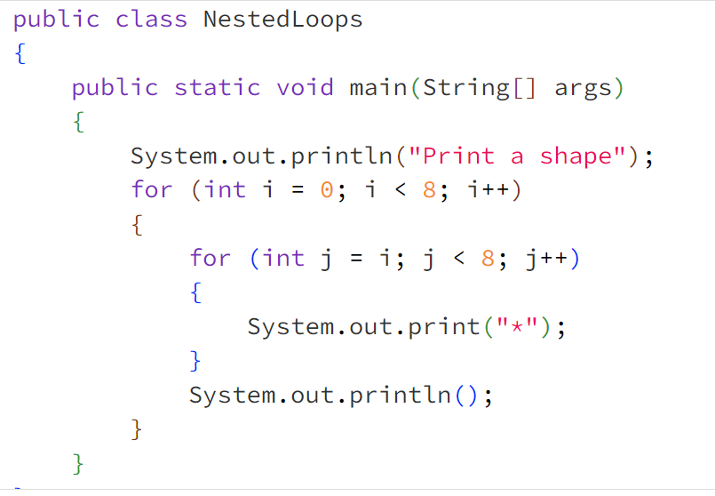

Class:
{
    fields: to store value
    constructor: initialize(the object)
    method: implement the behaviour of object

}
# Method:
access modifier 
return datatype
## Local variable
## precedence
# Questions
## 1. What is the correct way to declare and initialize an integer variable in Java?
 int number = 10;
 int Number = &#39;10&#39;;
 Int number = 10;
 number = int 10;
2. Which of the following statements about the String data type in Java is true?
 String is a primitive type and uses single quotes for its values.
 String is a special class that can be used without creating an object and uses
double quotes for its values.
 String is a primitive type and uses double quotes for its values.
 String is an object type that cannot be used without creating an object.
3. What is the purpose of the assignment operator (=) in Java?
 To declare a variable.
 To assign a value to a variable.
 To compare two variables.
 To create a new class.
4. Which of the following is a correct way to declare a char variable in Java?
 char letter = &quot;A&quot;;
 char letter = A;
 char letter = &#39;A&#39;;
 char letter = &#39;10&#39;;
5. Which of the following is NOT a primitive data type in Java?
 int
 double
 boolean
 String

# iteration 
the main purpose of iteration is to allow a computing system to perform tasks repeatedly until a certain condition is met.

# Initialisation of a counter or flag
We can have a counter that keeps track of the number of times the loop runs. Alternatively, if we do not have a fixed number of iterations in mind, we can initialise a boolean flag and the loop will keep running until the flag's value is changed—for example, from true to false. When executing a loop, the instruction to initialise the counter or flag is only executed once.

# Boolean condition
A boolean condition is used to decide when to stop repeating the loop and exit to the next instruction following the loop construct. We can specify compound conditions where the loop iterates until all the conditions are met. The boolean condition is evaluated with each iteration of the loop and the loop executed repeatedly until the condition has been met.

# for loop

# while loop

# do-while
Similar to the while loop, the do-while loop does the initialisation once outside the loop body. The body of the loop is then executed. At the bottom of the loop the increment/decrement/reset is performed. Then the boolean condition is tested and if it evaluates to true, the loop is executed again.  This is repeated until the boolean condition evaluates to false.

The main difference between the while and do-while loops is that the do-while loop runs at least one time whereas the while loop may not execute even once.

# Nesting loops
Loops can be nested within each other in a similar way to selection statements.  Here is an example.  Try to work out what the code will do before you run the program. 

# Exiting Loops
The break statement is used to terminate the loop immediately and the continue statement is used to skip the current iteration of the loop. 

## collections
Java addresses the need for data structures through the use of collections. Collections allow the programmer to store data in an organised way within the program. 
Most of the collections in Java are found in the java.util.Collection framework of classes in the Java library.  The Collection framework supports three main type of collections - Lists, Queues, and Sets. 
  Another type of collection in Java, which is not part of the Collection framework, is an array. 
  ## The main difference is that arrays need to be assigned a certain capacity when instantiated;
   the other collections can grow and shrink in size automatically when objects are added or removed.

   # data structure-- Array
  The first type of data structure we will discuss is a fixed-size collection, also known as an array.
  --supported in almost every programming language.
  --Arrays are collections whose size is defined by the programmer when the array is initialised, and this size cannot be changed over the lifetime of the variable
  --Since arrays have a fixed size, the computing system allocates the memory for the entire array of elements sequentially. This means that accessing items within the array is quicker and more efficient than variable size data structures.
  ## size of array wont changed

  # nextline()
  advances this scanner past the current line and returns the input that was skipped.

  # string.charA
  # string.length
  # .nextInt

  # Substring of a string
A substring of a string may be obtained using the substring() method in the String class.  The substring() method returns the substring as specified by index values passed to this method. There are two variants of the method, one where the start index is specified and the other where you can specify both start and end indexes.

aString.substring(startIndex) // returns the substring from the specified index
aString.substring(startIndex, endIndex) // returns the substring from the specified   
                                           // start index until (but not including)the 
                                           // character at the end index
substring(0,3)

## equals
if ( a equals b)--------if (a==b)