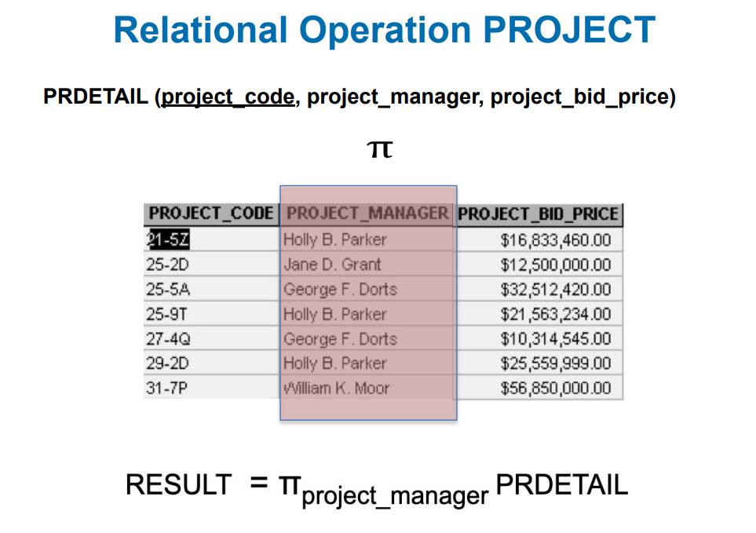

# Weak vs Strong Entity

## Strong entity

-- entity is something like a branch, class
-has a key which may be deined without reference to other entities.

- for example employee entity
  -----strong entity do not need other things to proof its identity

## Weak enity

- has a key which requires the existence of one or more other entities
- for example family entity - need to include the key of employee to create a suitable key for  family
  ---weak entity does not got unique key

## Database designer often determines whether an entity can be described as weak based on business rules

- customer pays monthly acount
  -- key: cust_no, date_paid,or
  -- invented Key: payment_no(surrogate - not at conceptual level)

# Identifying vs Non-identitying relationship

## iedntifying

-- identifier of A is part of identifier of B
--shown with solid line

## non- identitying

-- identifier of A is not part of idntifier of B

# types of attributes

▪ Simple
– Cannot be subdivided
– Age, sex, marital status
vs
▪ Composite
– Can be subdivided into
additional attributes
– Address into street, city, zip
▪ Single-valued
– Can have only a single value
– Person has one social security
number
vs
▪ Multi-valued
– Can have many values
– Person may have several college
degrees

# Types of Attributes continue

▪ Derived
– Can be derived (calculated ) from
other attributes
– Age can be derived from date of
birth (why would we not store age in
a database?)
– total value of an order can be
calculated from items in the order
– Difficult to judge - store or calculate,
during design ALWAYS include all
attributes required by the client

# Associative or composite entity

usually need bridging entity

# Foreign Key

- role of foreign key is to connect

the line means maximum and minimum
relationship must have description

## Relation Properties contidion
- Tuple values are atomic---cannot be divided
---- employee(eid, ename,departno, dependants)
-----not allowed: dependants(dep_name, dep_age) multivalued 
--- hence no multivalued(repeating) attributes allowed, called the first normal form rule

# question:

### candidate key
unique, in order to identify, minimum unit of super key
### super key
as long as super include a candidate key, it becomes super key
### primary key
can be only one

# Null

# Writing Relations
-relations may be represented using the following notation

# Business rules
- runners may form a team, the runner who registers the team is recorded as the team leader.
- identify the FK(s):
TEAM(team_id, team_name, team_leader)
RUNNER(runner_id, runner_name, team_id)
A. team_leader in Team
B. runner_id in RUNNER
D. Team_id in RUNNER

# Relational DMLs
▪ Relational Calculus
▪ Relational Algebra
the way to manipulate data
▪ Transform Oriented Languages (e.g. SQL)
▪ Graphical Languages
▪ Exhibit the “closure” property - queries on relations produce
relations

# SQL vs Relational ALgebra in the Database

select project_manager
FROM prdetail
WHERE project_code = '25-5A

## natural join